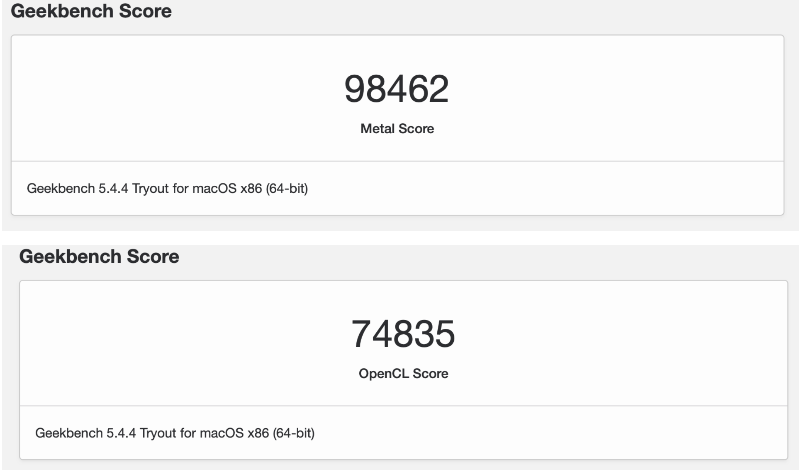

# 中文版

## 配置

| 组件 | 名称                                                        |
| ---- | ----------------------------------------------------------- |
| CPU  | i7-10700                                                    |
| 主板 | 华擎 AsRock Z490 Steel Legend 钢铁传奇                      |
| 显卡 | Intel UHD Graphics 630 + 蓝宝石 AMD Radeon RX 6600XT 白金版 |
| 机型 | iMac 20,1                                                   |
| 网卡 | BCM94360CD                                                  |

## BIOS

实际上国光我的「华擎 AsRock Z490 Steel Legend 钢铁传奇」主板 BISO 主要调整如下：

- 「高级」-「CPU 配置」-「Intel Hyper Threading Technology」-「开启」
- 「高级」-「CPU 配置」-「CFG Lock」-「关闭」
- 「高级」-「CPU 配置」-「Software Guard Extensions（SGX）」-「关闭」
- 「高级」-「芯片组配置」-「Above 4G Decoding」-「启用」
- 「高级」-「芯片组配置」-「VT-d」-「禁用」
- 「高级」-「芯片组配置」-「共享内存」-「64MB」
- 「高级」-「芯片组配置」-「IGPUA 多监视器」-「启用」
- 「高级」-「芯片组配置」-「深度睡眠」-「在 S4-S5 中启用」
- 「高级」-「存储 配置」-「SATA 模式选择」-「AHCI」
- 「高级」-「Intel(R) Thunderbolt」-「Discrete Thunderbolt(TM) Support」-「关闭」
- 「高级」-「ACPI 配置」-「挂起到内存」-「自动」
- 「高级」-「ACPI 配置」-「USB 键盘/远程开机」-「Disabled」
- 「高级」-「ACPI 配置」-「USB 鼠标开机」-「Disabled」
- 「高级」-「USB 配置」-「XHCI Hand-off」-「Enabled」
- 「安全」-「Secure Boot」-「安全引导」-「关闭」
- 「安全」-「Intel(R) Platform Trust Technology」-「禁用」
- 「引导」-「闪速启动」-「关闭」
- 「引导」-「CSM」-「关闭」

## Geekbench5 GPU

蓝宝石 RX6600XT 白金版本，可以看出比正常高出不少分，这是为什么呢，这是因为 XXXXXX（比较长 懒得写了），总之说明 6000系列 macOS 驱动层面还是有很多优化空间的：

  

# 打赏 Reward

因为黑苹果驱动定制是很耗费时间的事情，为了追求完美需要各种优化，生活不易，猫猫叹气，如果你恰巧财力雄厚的话，可以考虑打赏下本文哦，打赏情况国光我也会同步更新我的打赏列表的：[打赏列表 | 国光](https://www.sqlsec.com/dashang.html) 

<table>
    <tr>
        <td>
            

        </td>
        <td width="50%">
            

        </td>
    </tr>
</table>
