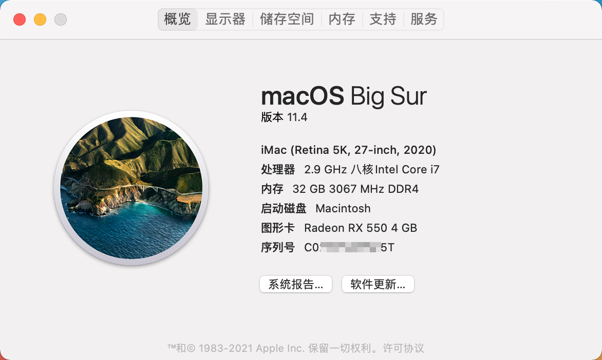
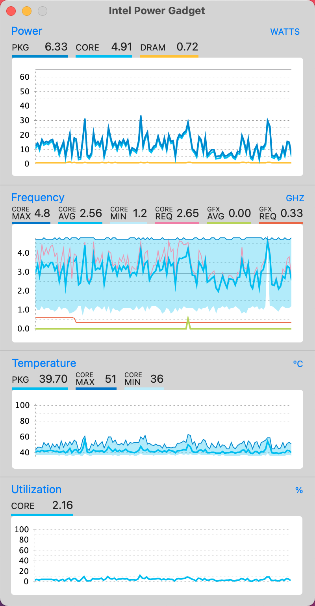
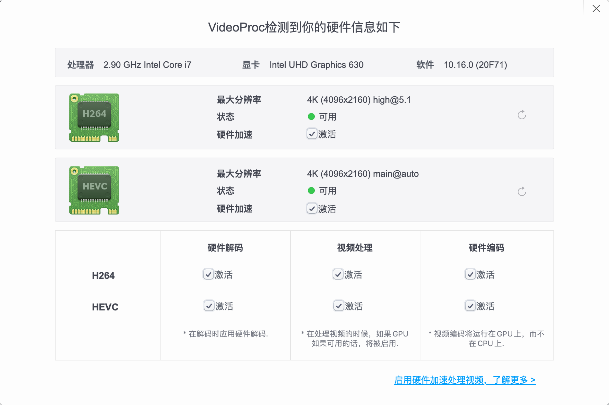
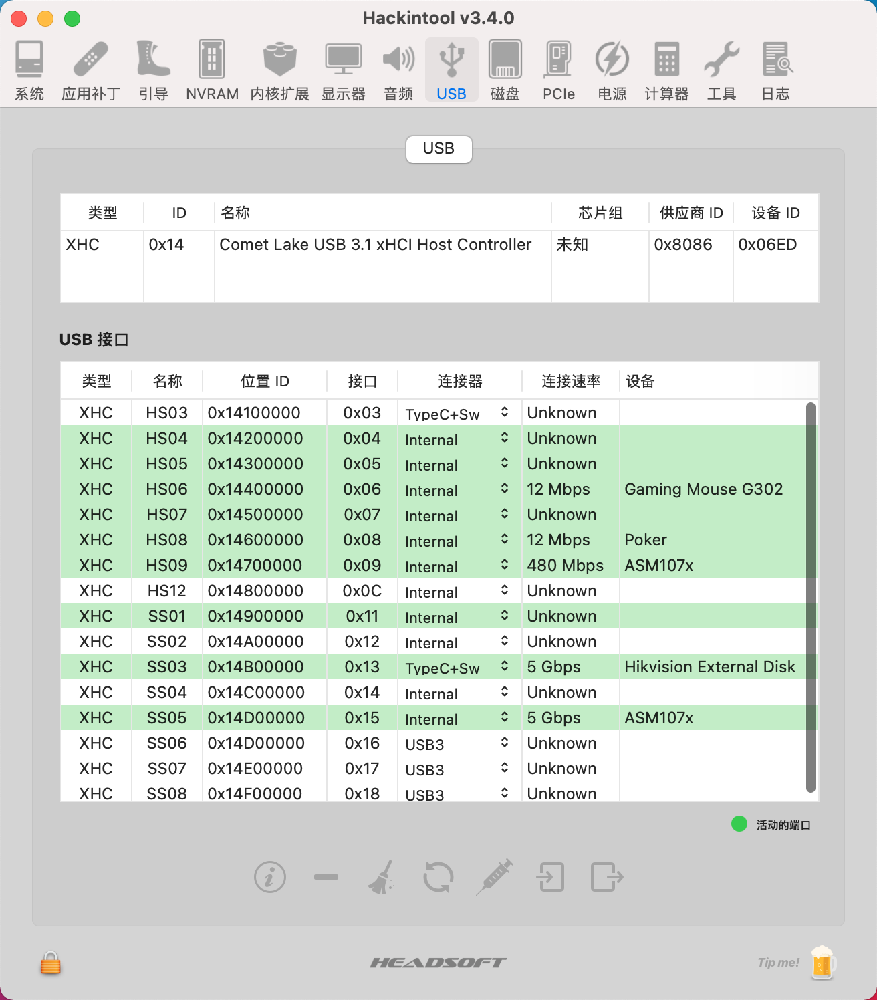
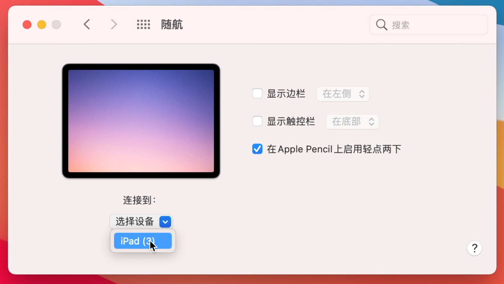
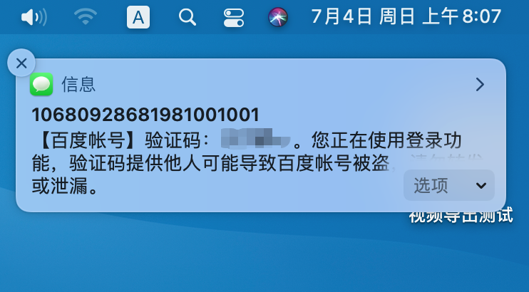
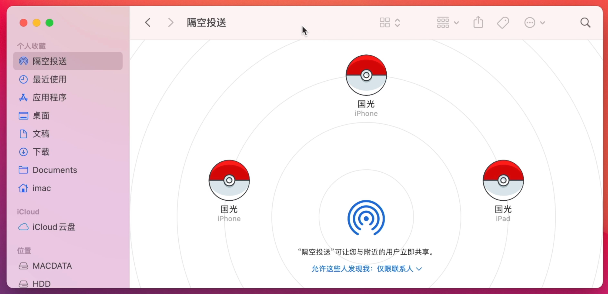
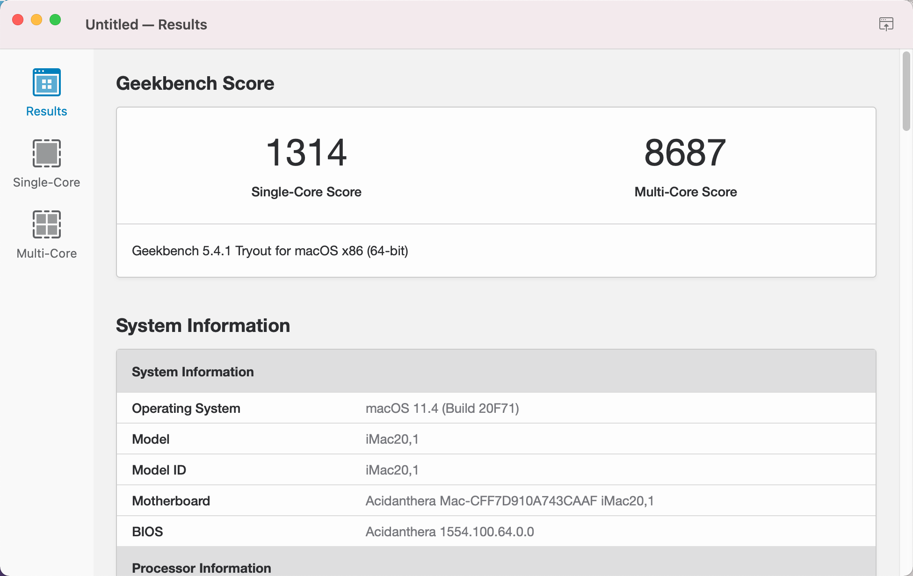

# 中文版

## 配置

macOS Big Sur 11.5 + OpenCore 0.7.1

| 组件 | 名称                                   |
| ---- | -------------------------------------- |
| CPU  | i7 10700                               |
| 主板 | 华擎 AsRock Z490 Steel Legend 钢铁传奇 |
| 显卡 | Intel UHD Graphics 630                 |
| 机型 | iMac 20,1                              |
| 网卡 | BCM94360CD                             |

## BIOS

实际上国光我的「华擎 AsRock Z490 Steel Legend 钢铁传奇」主板 BISO 主要调整如下：

- 「高级」-「CPU 配置」-「Intel Hyper Threading Technology」-「开启」
- 「高级」-「CPU 配置」-「CFG Lock」-「关闭」
- 「高级」-「CPU 配置」-「Software Guard Extensions（SGX）」-「关闭」
- 「高级」-「芯片组配置」-「Above 4G Decoding」-「启用」
- 「高级」-「芯片组配置」-「VT-d」-「禁用」
- 「高级」-「芯片组配置」-「共享内存」-「64MB」
- 「高级」-「芯片组配置」-「IGPUA 多监视器」-「启用」
- 「高级」-「芯片组配置」-「深度睡眠」-「在 S4-S5 中启用」
- 「高级」-「存储 配置」-「SATA 模式选择」-「AHCI」
- 「高级」-「Intel(R) Thunderbolt」-「Discrete Thunderbolt(TM) Support」-「关闭」
- 「高级」-「ACPI 配置」-「挂起到内存」-「自动」
- 「高级」-「ACPI 配置」-「USB 键盘/远程开机」-「Disabled」
- 「高级」-「ACPI 配置」-「USB 鼠标开机」-「Disabled」
- 「高级」-「USB 配置」-「XHCI Hand-off」-「Enabled」
- 「安全」-「Secure Boot」-「安全引导」-「关闭」
- 「安全」-「Intel(R) Platform Trust Technology」-「禁用」
- 「引导」-「闪速启动」-「关闭」
- 「引导」-「CSM」-「关闭」

# English version

macOS Big Sur 11.4 + OpenCore 0.7.1

| Component  | Brank                    |
| ---------- | ------------------------ |
| CPU        | i7 10700                 |
| Motheboard | AsRock Z490 Steel Legend |
| GPU        | Intel UHD Graphics 630   |
| SMBIOS     | iMac 20,1                |
| WiFi       | BCM94360CD               |

# 驱动情况 What works

- [x] All USB Ports (port mapping performed)
- [x] All Sensors (CPU, GPU, NVME, SATA, FANS)
- [x] SpeedStep / Sleep / Wake
- [x] Wi-Fi and Bluetooth
- [x] Handoff and  AirDrop
- [x] Windows 10 boot from OpenCore

## OpenCore 0.7.1

 

## 系统 OS

 

## CPU

 

## GPU 

 

## USB

  

## 随航 Sidecar

 

## 接力 Handoff

 

## 短信 iMessage

  

## 隔空投送 AirDrop

 

## Geekbench5 CPU 

  

## Geekbench5 GPU

  

# 演示视频  Video presentation

写这篇文章的同时，也单独在 B 站投稿了视频，主要说明了本次配置的驱动效果情况：

[你的黑苹果驱动到底有多完美了？附上本次设备和驱动](https://www.bilibili.com/video/BV15X4y1w7Wn)

# 打赏 Reward

<table>
    <tr>
        <td>
            

        </td>
        <td width="50%">
            

        </td>
    </tr>
</table>

